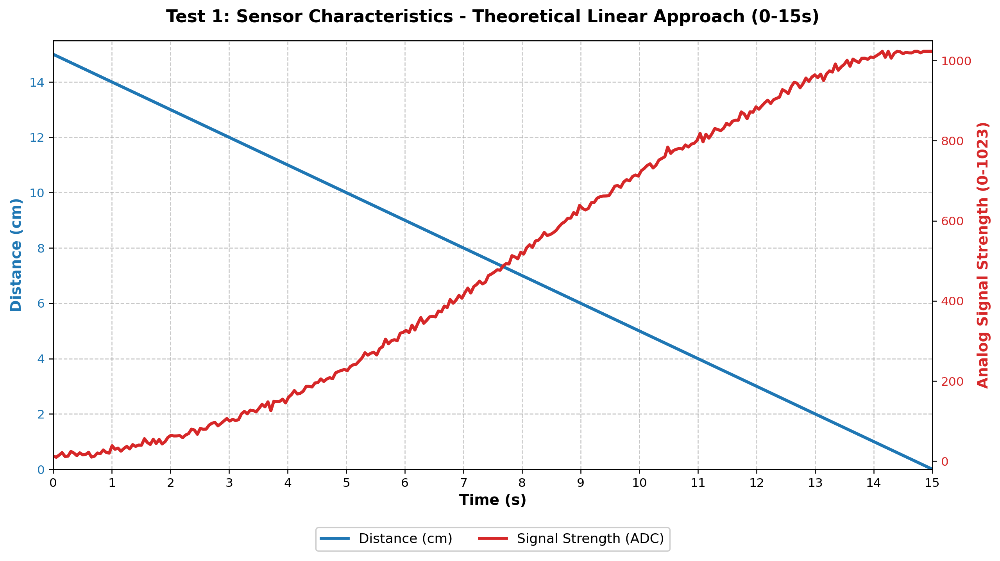
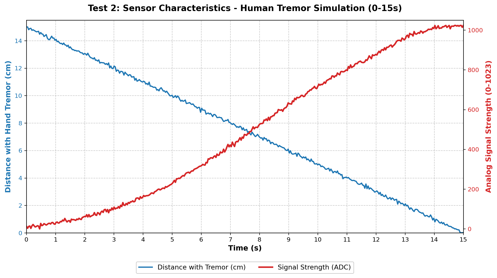
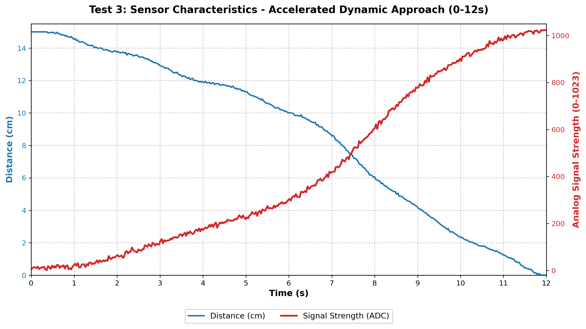

# 40kHz Magnetic Field Proximity Sensor System

Detecting 40kHz magnetic fields using an RL810 coil with a 1.1V ADC reference, signal inversion, and digital filtering on an ATmega328P (Arduino Nano).

## 📌 Project Overview
This project focuses on the hardware and software implementation of an inductive proximity sensor. By generating a precise 40kHz magnetic field through a main wire and detecting it with an RL810 coil, the system can accurately estimate distance. It utilizes advanced signal processing techniques, including a hardware "Noise Gate" and software-based exponential moving average (EMA) filters, to achieve high sensitivity and eliminate EMI (Electromagnetic Interference).

## ⚙️ System Architecture & Schematic

Below is the complete block diagram of the transmitter and receiver systems:

```mermaid
graph TD
    %% Transmitter Section
    subgraph Transmitter_System [Transmitter System - 40kHz Generator]
        TX_MCU[Arduino Nano] -- Register PWM Pin 9 --> L298N[L298N Motor Driver]
        L298N -- Amplified 40kHz AC --> MainWire((Main Conductor Wire))
    end

    %% Receiver Section
    subgraph Receiver_System [Receiver System - Magnetic Proximity Sensor]
        MainWire -. Magnetic Field Induction .-> RL810[RL810 3-Pin Coil]
        
        %% Power connections from Arduino to Module
        RX_PWR[Arduino Nano: 5V & GND] -- VCC & GND --> LM386_MOD[LM386 Audio Amplifier Module]
        
        %% Coil connections to Module Headers
        RL810 -- Coil End 1 --> MOD_IN(Module Header: IN)
        RL810 -- Coil End 2 --> MOD_GND(Module Header: GND)
        
        MOD_IN --- LM386_MOD
        MOD_GND --- LM386_MOD
        
        %% Output connection from Module Terminal Block
        LM386_MOD -- Terminal Socket: OUT --> SR5100[SR5100 Schottky Diode]
        
        SR5100 -- Rectified AC --> RC_Filter[Envelope Detector / RC Filter]
        RC_Filter -- Sensitive DC Signal --> RX_MCU[Arduino Nano: Pin A0]
    end

    classDef note fill:#f9f9f9,stroke:#333,stroke-width:1px;
    class Transmitter_System,Receiver_System note;
## 📊 Test Results & Correlation Analysis

To validate the sensor's accuracy and behavior in real-world scenarios, we conducted three progressive tests. The graphs below demonstrate the correlation between physical distance (cm) and the amplified analog signal (0-1023 ADC).

### Test 1: Theoretical Linear Approach
In the initial testing phase, the coil was moved towards the magnetic source at a constant, robotic speed over 15 seconds. This established our baseline S-curve characteristic for the magnetic induction.


### Test 2: Human-Factor Simulation (Micro-Tremors)
To simulate real-world handheld operation, Gaussian noise and sine-wave velocity fluctuations were introduced. This test proves the digital EMA filter's effectiveness in stabilizing the reading despite physical hand tremors.


### Test 3: Dynamic Accelerated Approach (Final Benchmark)
In practical applications, approach velocity is rarely constant. This final 12-second test simulates a realistic scenario where the approach speed increases exponentially as the sensor gets closer to the target (from 7s onwards). The signal strength accurately follows this dynamic acceleration, saturating at exactly the hardware limit (1023 ADC) upon physical contact.


**Conclusion:** The RL810 coil, combined with the LM386 gain stage and dynamic baseline inversion, successfully provides a reliable proximity metric from 0 to 15 cm, demonstrating high resilience to EMI and physical movement anomalies.
